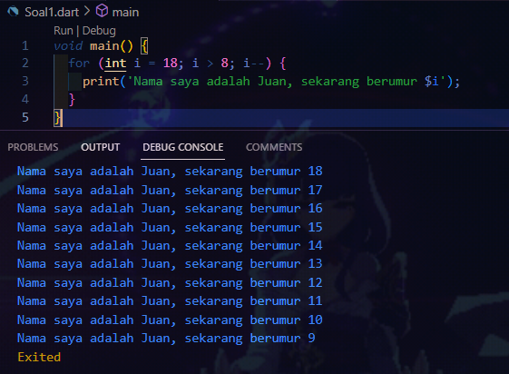

# Week 02 - Introduction to Dart

**Nama :** Juan Felix Antonio Nathan Tote 
**NIM :** 2241720042 
**Kelas :** TI-3B 
**Absen :** 14

### Soal 1

Modifikasilah kode pada baris 3 di VS Code atau Editor Code favorit Anda berikut ini agar mendapatkan keluaran (output) sesuai yang diminta!

### Soal 2
Mengapa sangat penting untuk memahami bahasa pemrograman Dart sebelum kita menggunakan framework Flutter ? Jelaskan!

    Karena framework Flutter secara khusus menggunakan bahasa pemrograman Dart dalam pengembangannya, pemahaman dasar tentang bahasa Dart sangat penting agar dapat mengembangkan aplikasi dengan menggunakan Flutter.

### Soal 3
Rangkumlah materi dari codelab ini menjadi poin-poin penting yang dapat Anda gunakan untuk membantu proses pengembangan aplikasi mobile menggunakan framework Flutter.

**Getting Started with Dart :** 
    - **Productive tooling:** : Menyediakan alat analisis kode, plugin IDE, dan ekosistem paket yang luas. 
    - **Garbage collection:** Mengelola alokasi memori dengan fokus pada objek yang tidak lagi digunakan. 
    - **Type annotations (opsional):** Menawarkan keamanan dan konsistensi data aplikasi. 
    - **Statically typed:** Dart memberikan keamanan dengan fitur type-safe dan type inference. 
    - **Portability:** Dart dapat dikompilasi ke dalam JavaScript, ARM, dan x86. 

**Dart Syntax :** 
    •	Awalnya dirancang untuk pengembangan web, tetapi kini lebih fokus pada pengembangan mobile dengan Flutter. 
    •	Tujuan utama Dart adalah menggantikan JavaScript untuk meningkatkan ketahanan dan performa. 
    •	Dart menawarkan performa tinggi dan alat modern untuk proyek besar. 
    •	Bahasa Dart dirancang untuk kuat dan fleksibel dengan anotasi tipe opsional serta fitur pemrograman berorientasi objek (OOP). 

**Dalam eksekusi kode Dart, terdapat dua mode utama, yaitu:**

**Kompilasi Just-In-Time (JIT):** 
    Kode sumber dikompilasi saat dibutuhkan (Just in time) oleh Dart VM, mengubah kode menjadi kode mesin asli saat program berjalan. Mode ini digunakan untuk menjalankan kode di command line atau selama pengembangan aplikasi mobile, dengan dukungan untuk debugging dan hot reload.

**Kompilasi Ahead-Of-Time (AOT):** 
    Kode Dart dan Dart VM dikompilasi sebelum aplikasi dijalankan. Dart VM bertindak sebagai sistem runtime, menyediakan garbage collector dan metode-metode native dari Dart SDK. Mode ini memberikan performa yang lebih baik karena kode sudah dalam bentuk native, tetapi tidak mendukung debugging dan hot reload.

**Introducing the structure of the Dart language:** 
	•	Dart adalah bahasa pemrograman berorientasi objek yang berfokus pada objek yang menyimpan data (fields) dan kode (methods). 
	•	Operator di Dart pada dasarnya adalah metode yang didefinisikan dalam kelas dengan sintaks khusus. 
	•	Operator seperti penambahan dan pengurangan juga merupakan operator umum yang diimplementasikan pada tipe data angka. 
### Soal 4
Buatlah slide yang berisi penjelasan dan contoh eksekusi kode tentang perbedaan Null Safety dan Late variabel ! (Khusus soal ini kelompok berupa link google slide)
Kumpulkan jawaban Anda di spreadsheet pada tautan yang telah disediakan di grup telegram. Untuk soal nomor 1 sampai 3 push repo GitHub Anda.

Berikut adalah link untuk slide penjelasan dan contoh eksekusi kode tentang perbedaan Null Safety dan Late variabel :

[Link Canva](https://www.canva.com/design/DAGPkygkyk8/a6nO0riqqmWgRnEhAr3JzQ/edit)
