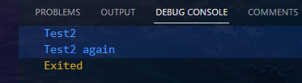
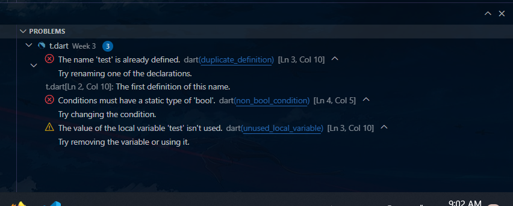
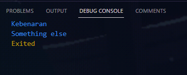
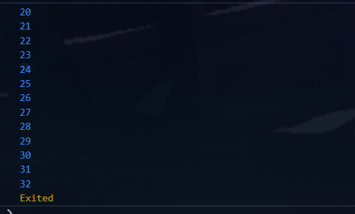
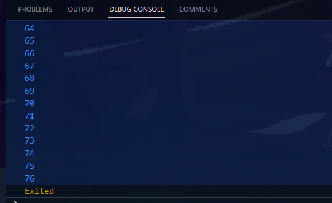
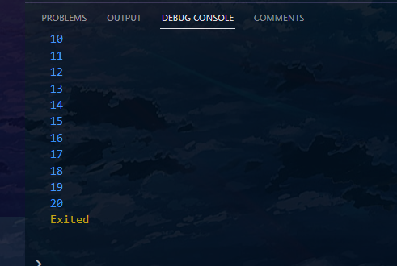
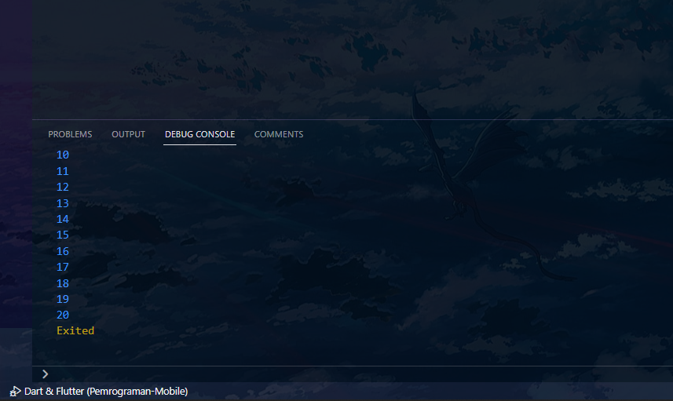
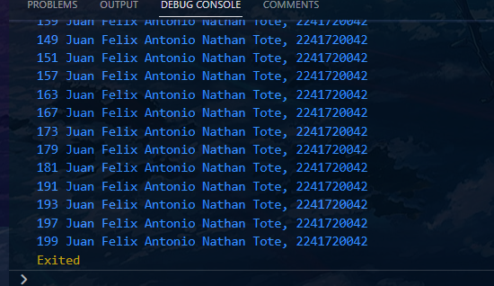

# Week 02 - Introduction to Dart

**Nama :** Juan Felix Antonio Nathan Tote<br>
**NIM :** 2241720042<br>
**Kelas :** TI-3B<br>
**Absen :** 14

### Praktikum 1 : Menerapkan Control Flows ("if/else")
## Langkah 1
Ketik atau salin kode program berikut ke dalam fungsi main().
``` dart
void main() {
  String test = "test2";
  
  if (test == "test1") {
    print("Test1");
  } else if (test == "test2") {
    print("Test2");
  } else {
    print("Something else");
  }

  if (test == "test2") {
    print("Test2 again");
  }
}
```
## Langkah 2
    Pada variabel test berisi "test2" maka output pertama adalah 'Test2', kemudian di kode program paling bawah terdapat kondisi if yang mana jika nilai variabel 'test' adalah 'test2' maka outputnya adalah 'Test2 again'.



<br>
Langkah 3:
Tambahkan kode program berikut, lalu coba eksekusi (Run) kode Anda.

``` dart
String test = "true";
if (test) {
   print("Kebenaran");
}

```
Apa yang terjadi ? Jika terjadi error, silakan perbaiki namun tetap menggunakan if/else.


    Setelah diperbaiki
``` dart
void main() {
  String test = "true"; 

  if (test == "true")  {
    print("Kebenaran");
  }
  if (test == "test1") {
    print("Test1");
  } else if (test == "test2") {
    print("Test2");
  } else {
    print("Something else");
  }

  if (test == "test2") {
    print("Test2 again");
  }
}

```

  yang menghasilkan output

  

### Praktikum 2: Menerapkan Perulangan "while" dan "do-while"
## Langkah 1:
Ketik atau salin kode program berikut ke dalam fungsi main().
```dart
while (counter < 33) {
  print(counter);
  counter++;
}
```

## Langkah 2
    Pada variabel counter berisi angka 0, lalu di dalam kode program ada perulangan while yang mana perulangan ini akan terus berjalan sampai counter bernilai kurang dari 33.


## Langkah 3
Tambahkan kode program berikut, lalu coba eksekusi (Run) kode Anda.
```dart
do {
  print(counter);
  counter++;
} while (counter < 77);
```
Apa yang terjadi ? Jika terjadi error, silakan perbaiki namun tetap menggunakan do-while.

  Sama seperti langkah 2 tetapi pada langkah 3 tidak menggunakan kurung kurawal. Dan pada langkah 3 terdapat perulangan do-while yang mencetak angka dari 0 sampai kurang dari 76.



### Praktikum 3: Menerapkan Perulangan "for" dan "break-continue"
## Langkah 1
Ketik atau salin kode program berikut ke dalam fungsi main().
```dart
for (int index = 10; index < 27; index++) {
  print(index);
}
```
## Langkah 2
  Silakan coba eksekusi (Run) kode pada langkah 1 tersebut. Apa yang terjadi? Jelaskan! Lalu perbaiki jika terjadi error.
  Pada variabel index berisi angka 10, lalu di dalam kode program ada perulangan for yang mana perulangan ini akan terus berjalan sampai index bernilai kurang dari 27. Jadi outputnya adalah 10, 11, 12, 13, 14, 15, 16, 17, 18, 19, 20, 21, 22, 23, 24, 25, 26



## Langkah 3
Tambahkan kode program berikut di dalam for-loop, lalu coba eksekusi (Run) kode Anda.
```dart
If (Index == 21) break;
Else If (index > 1 || index < 7) continue;
print(index);
```

Apa yang terjadi ? Jika terjadi error, silakan perbaiki namun tetap menggunakan for dan break-continue.

 Pada langkah ini terdapat kondisi if (Index == 21) break. Jika Index bernilai 21, maka perulangan akan berhenti. Selain itu, jika index bernilai lebih dari 1 atau lebih kecil dari 7, maka perulangan akan dilanjutkan, yang akan menampilkan output



### Tugas Praktikum
    1.  Silakan selesaikan Praktikum 1 sampai 3, lalu dokumentasikan berupa screenshot hasil pekerjaan beserta penjelasannya!
    2.  Buatlah sebuah program yang dapat menampilkan bilangan prima dari angka 0 sampai 201 menggunakan Dart. Ketika bilangan prima ditemukan, maka tampilkan nama lengkap dan NIM Anda.
    Jawab
