# Week 04 - Introduction to Dart

**Nama :** Juan Felix Antonio Nathan Tote<br>
**NIM :** 2241720042<br>
**Kelas :** TI-3B<br>
**Absen :** 14

### Praktikum 1 : Menerapkan Control Flows ("if/else")
## Langkah 1
Ketik atau salin kode program berikut ke dalam void main().
```dart
void main() {
  var list = [1, 2, 3];
assert(list.length == 3);
assert(list[1] == 2);
print(list.length);
print(list[1]);

list[1] = 1;
assert(list[1] == 1);
print(list[1]);

}
```

## Langkah 2
    Ketika code di jalankan, akan mengeluarkan output berupa 3, 2, 1 dikarenakan pada var list terdapat 1,2,3 nilai lalu code tersebut akan memeriksa panjang list array sebanyak 3 yang dapat dilihat dali list.length == 3. Maka panjangnya adalah 3, sehingga output pertama 3,setelah itu code mencetak angka kedua 2 dikarenakan code tersebut memeriksa angka kedua list[1] == 2. dan setelah itu code mencetak angka ketiga 1, dikarenakan code tersebut memeriksa angka ketiga list[1] == 1. 

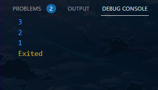

## Langkah 3
```dart
void main() {
  final List<String?> list = List.filled(5, null); 
  list[1] = "Juan"; 
  list[2] = "2241720042"; 
  print(list);
}
```
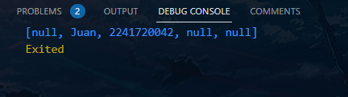

### Praktikum 2: Eksperimen Tipe Data Set
## Langkah 1
Ketik atau salin kode program berikut ke dalam fungsi main().
```dart
void main(){
  var halogens = {'fluorine', 'chlorine', 'bromine', 'iodine', 'astatine'};
print(halogens);
}
```

## Langkah 2
    Ketika code dijalankan, akan mengeluarkan output berupa {fluorine, chlorine, bromine, iodine, astatine}. Code tersebut membuat array list yang bernama var halogens yang berisi fluorine, chlorine, bromine, iodine, dan astatine. lalu code tersebut mengeksekusi print(halogens); dan tercetak seperti output diatas tadi.

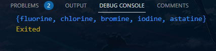

## Langkah 3

```dart
void main(){


var names1 = <String>{};
Set<String> names2 = {}; // This works, too.
var names3 = {}; // Creates a map, not a set.

print(names1);
print(names2);
print(names3);
}
```
Apa yang terjadi ? Jika terjadi error, silakan perbaiki namun tetap menggunakan ketiga variabel tersebut. Tambahkan elemen nama dan NIM Anda pada kedua variabel Set tersebut dengan dua fungsi berbeda yaitu .add() dan .addAll(). Untuk variabel Map dihapus, nanti kita coba di praktikum selanjutnya.

```dart
void main(){
  var names1 = <String>{}; 
  Set<String> names2 = {}; 

  names1.add("Juan");
  names1.add("2241720042");
  names2.addAll({"Juan", "2241720042"});
  
  print("Names1: $names1");
  print("Names2: $names2");
}
```
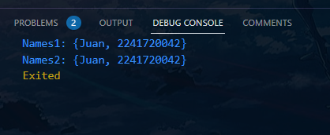

### Praktikum 3: Eksperimen Tipe Data Map
## Langkah 1
Ketik atau salin kode program berikut ke dalam fungsi main().
```dart
void main(){
    var gifts = {
  // Key:    Value
  'first': 'partridge',
  'second': 'turtledoves',
  'fifth': 1
};

var nobleGases = {
  2: 'helium',
  10: 'neon',
  18: 2,
};

print(gifts);
print(nobleGases);
}
```

## Langkah 2
    Code diatas ketika dijalankan akan menghasilkan output seperti dibawah dikarekana code ini menunjukkan cara membuat dan mengakses map yang berisi pasangan key-value dengan berbagai tipe data (string, integer), yang map gift menggunakan key berupa string dan nobleGases menggunakan key berupa integer.

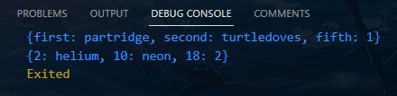

## Langkah 3
```dart
void main() {
var mhs1 = Map<String, String>();
gifts['first'] = 'partridge';
gifts['second'] = 'turtledoves';
gifts['fifth'] = 'golden rings';

var mhs2 = Map<int, String>();
nobleGases[2] = 'helium';
nobleGases[10] = 'neon';
nobleGases[18] = 'argon';
}
```
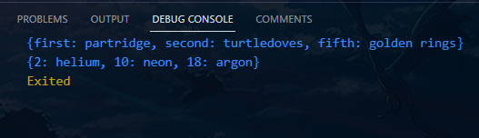

Tambahkan elemen nama dan NIM Anda pada tiap variabel di atas (gifts, nobleGases, mhs1, dan mhs2)

```dart
void main() {
    var mhs1 = Map<String, String>();
mhs1['nama'] = 'Juan';
mhs1['NIM'] = '2241720042';
mhs1['first'] = 'partridge';
mhs1['second'] = 'turtledoves';
mhs1['fifth'] = 'golden rings';

var mhs2 = Map<int, String>();
mhs2[2] = 'helium';
mhs2[10] = 'neon';
mhs2[18] = 'argon';

print(mhs1);
print(mhs2);
}
```
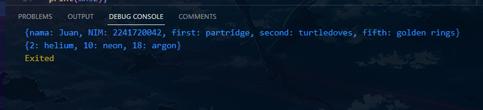

### Praktikum 4: Eksperimen Tipe Data List: Spread dan Control-flow Operators
## Langkah 1
Ketik atau salin kode program berikut ke dalam fungsi main().
```dart
    void main(){
    var list1 = [1, 2, 3];
    var list2 = [0, ...list1];
    print(list1);
    print(list2);
    print(list2.length);
    }
```

## Langkah 2
    Code diatas ketika dijalankan akan menggayakan output seperti dibawah, dikarenakan Spread operator (...) digunakan untuk menyisipkan elemen-elemen dari list lain ke dalam list baru. Dan code ini menunjukkan cara menambahkan elemen baru ke list yang sudah ada tanpa mengubah list aslinya.

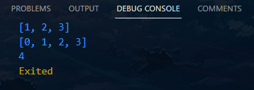

## Langkah 3
Tambahkan kode program berikut, lalu coba eksekusi (Run) kode Anda.
```dart
void main() {
list1 = [1, 2, 3];
print(list1);
var list3 = [0, 2,3, ...list1];
print(list3.length);
}
```
Apa yang terjadi ? Jika terjadi error, silakan perbaiki.

Tambahkan variabel list berisi NIM Anda menggunakan Spread Operators. Dokumentasikan hasilnya dan buat laporannya!
```dart
var list1 = [1, 2, 3];
print(list1);
var list4 = [2, 2, 4, 1, 7, 2, 0, 0, 4, 2];
print(list4);
var list3 = [0, 2,3, ...list1];
print(list3.length);
```

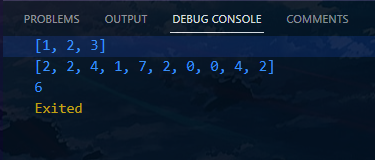

## Langkah 4
Tambahkan kode program berikut, lalu coba eksekusi (Run) kode Anda.
```dart
void main() {
var promoActive = true;
//var promoActive = false;
var nav = ['Home', 'Furniture', 'Plants', if (promoActive) 'Outlet'];
print(nav);
}
```
Apa yang terjadi ? Jika terjadi error, silakan perbaiki. Tunjukkan hasilnya jika variabel promoActive ketika true dan false.

    True
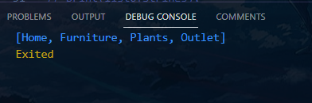

    False
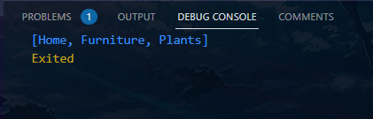

## Langkah 5
Tambahkan kode program berikut, lalu coba eksekusi (Run) kode Anda
```dart
void main() {var login = 'Manager';
var nav2 = ['Home', 'Furniture', 'Plants', if (login case 'Manager') 'Inventory'];
print(nav2);
}
```
Apa yang terjadi ? Jika terjadi error, silakan perbaiki. Tunjukkan hasilnya jika variabel login mempunyai kondisi lain.

    Login Manager
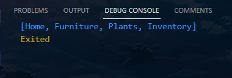

    Login not Manager
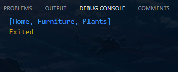

## Langkah 6
Tambahkan kode program berikut, lalu coba eksekusi (Run) kode Anda.
```dart
void main(){
    var listOfInts = [1, 2, 3];
var listOfStrings = ['#0', for (var i in listOfInts) '#$i'];
assert(listOfStrings[1] == '#1');
print(listOfStrings);
}
```

Apa yang terjadi ? Jika terjadi error, silakan perbaiki. Jelaskan manfaat Collection For dan dokumentasikan hasilnya.

    Collection For adalah fitur yang memungkinkan kita untuk menghasilkan daftar (list), set, atau map dengan cara yang lebih ringkas dan efisien berdasarkan iterasi dari koleksi atau kondisi tertentu

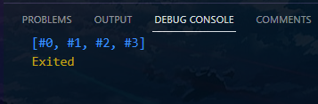

### Praktikum 5: Eksperimen Tipe Data Records
## Langkah 1
Ketik atau salin kode program berikut ke dalam fungsi main().
```dart
void main(){
    var record = ('first', a: 2, b: true, 'last');
  print(record);
}
```
## Langkah 2
    Record memungkinkan untuk mengelompokkan nilai dengan berbagai tipe data dalam satu struktur data tanpa harus membuat class atau struktur kompleks lainnya.


## Langkah 3
Tambahkan kode program berikut di luar scope void main(), lalu coba eksekusi (Run) kode Anda.
```dart
void main(){
  (int, int) tukar((int, int) record) {
    var (a, b) = record;
    return (b, a);
  }

  
  var nilai = (2, 3);
  print('Nilai sebelum ditukar: $nilai');

  
  var nilaiBaru = tukar(nilai);
  print('Nilai setelah ditukar: $nilaiBaru');
}
```

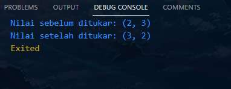

## Langkah 4
Tambahkan kode program berikut di dalam scope void main(), lalu coba eksekusi (Run) kode Anda.
```dart
  (String, int) mahasiswa = ('Juan', 2241720042);
  print(mahasiswa);

  var mahasiswa2 = ('first', a: 2, b: true, 'last');

print(mahasiswa2.$1); // Prints 'first'
print(mahasiswa2.a); // Prints 2
print(mahasiswa2.b); // Prints true
print(mahasiswa2.$2); // Prints 'last'
```
Apa yang terjadi ? Jika terjadi error, silakan perbaiki. Gunakan fungsi tukar() di dalam main() sehingga tampak jelas proses pertukaran value field di dalam Records.
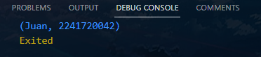

## Langkah 5
Tambahkan kode program berikut di dalam scope void main(), lalu coba eksekusi (Run) kode Anda.
Apa yang terjadi ? Jika terjadi error, silakan perbaiki. Gantilah salah satu isi record dengan nama dan NIM Anda, lalu dokumentasikan hasilnya dan buat laporannya!
```dart
void main(){
    var mahasiswa2 = ('first', a: 2, b: true, 'last');

print(mahasiswa2.$1); // Prints 'first'
print(mahasiswa2.a); // Prints 2
print(mahasiswa2.b); // Prints true
print(mahasiswa2.$2); // Prints 'last'
}
```
Apa yang terjadi ? Jika terjadi error, silakan perbaiki. Gantilah salah satu isi record dengan nama dan NIM Anda, lalu dokumentasikan hasilnya dan buat laporannya!

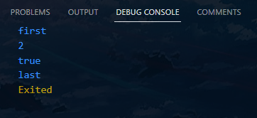

```dart
void main(){
    var mahasiswa2 = ('Juan', a: 2241720042, b: true, 'last');

print(mahasiswa2.$1); // Prints 'first'
print(mahasiswa2.a); // Prints 2
print(mahasiswa2.b); // Prints true
print(mahasiswa2.$2); // Prints 'last'
}
```
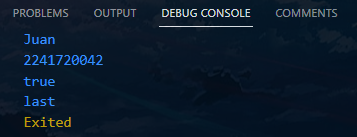

### Tugas Praktikum
1. Jelaskan yang dimaksud Functions dalam bahasa Dart!
    > adalah bagian dari program yang memiliki nama tertentu, digunakan untuk mengerjakan suatu pekerjaan tertentu, serta letaknya dipisahkan dari bagian program yang menggunakan fungsi tersebut.
2. Jelaskan jenis-jenis parameter di Functions beserta contoh sintaksnya!
    > Parameter fungsi adalah mekanisme untuk meneruskan nilai ke fungsi:
    ```dart
    void main() { 
   test_param(123,"ini adalah string"); 
   }  
   test_param(int angka1,String string1) { 
   print(angka1); 
   print(string1); 
   }
    ```
    > Parameter Opsional dapat digunakan ketika argument tidak tidak perlu diteruskan secara wajib untuk eksekusi fungsi. Diantaranya: <br>
    
    ###  Opsional Positional Parameter:
```dart
void greet(String name, [String? greeting]) {
  if (greeting != null) {
    print('$greeting, $name!');
  } else {
    print('Hello, $name!');
  }
}

void main() {
  greet('Alice'); // Hello, Alice!
  greet('Bob', 'Good morning'); // Good morning, Bob!
}

```

###  Opsional Named Parameter:
```dart
void greet({required String name, String? greeting}) {
  if (greeting != null) {
    print('$greeting, $name!');
  } else {
    print('Hello, $name!');
  }
}

void main() {
  greet(name: 'Alice'); // Hello, Alice!
  greet(name: 'Bob', greeting: 'Good evening'); // Good evening, Bob!
}

```

### Optional Parameter with Default Values:
```dart
void greet(String name, {String greeting = 'Hello'}) {
  print('$greeting, $name!');
}

void main() {
  greet('Alice'); // Hello, Alice!
  greet('Bob', greeting: 'Good morning'); // Good morning, Bob!
}

```
3. Jelaskan maksud Functions sebagai first-class objects beserta contoh sintaknya!
    > Functions diperlakukan sebagai objek pertama, sehingga dapat: Ditetapkan ke variabel, Dilewatkan sebagai argumen ke fungsi lain, Dikembalikan dari fungsi.
```dart
int tambah() {
  return 5 + 3;
}

void main() {
  print(tambah()); // Output: 8
}

```
4. Apa itu Anonymous Functions? Jelaskan dan berikan contohnya!
    > Anonymous Functions adalah fungsi yang tidak memiliki nama tertentu
```dart
void main() {
  var tambah = (int a, int b) {
    return a + b;
  };

  print(tambah(3, 4)); // Output: 7
}

```
5. Jelaskan perbedaan Lexical scope dan Lexical closures! Berikan contohnya!
    > Lexical scope
    >>Merupakan konsep scope yang berupa kumpulan fungsi yang bersarang. Inner function dapat mengakses variabel dan data dari parentnya. <br>

    >Lexical closures
    >>Merupakan penyimpanan suatu fungsi (kode) dan nilai parameternya saat dipanggil. 
    <br> <br>
    ### Contoh Lexical scope
```dart
void main() {
  var outerVariable = 'Hello';

  void innerFunction() {
    var innerVariable = 'World';
    print(outerVariable); // Mengakses variabel dari scope luar
    print(innerVariable); // Mengakses variabel dari scope saat ini
  }

  innerFunction();
  // print(innerVariable); // Error: innerVariable tidak dapat diakses di sini
}
```

### Contoh Lexical closures
```dart 
Function createCounter() {
  int count = 0; // Variabel di scope luar

  return () {
    count++; // Menangkap variabel count
    return count;
  };
}

void main() {
  var counter = createCounter();

  print(counter()); // Output: 1
  print(counter()); // Output: 2
  print(counter()); // Output: 3
}

```
6. Jelaskan dengan contoh cara membuat return multiple value di Functions!

### Menggunakan list
``` dart
List<int> hitung(int a, int b) {
  int jumlah = a + b;
  int selisih = a - b;
  return [jumlah, selisih]; // Mengembalikan list
}

void main() {
  var hasil = hitung(10, 5);
  print('Jumlah: ${hasil[0]}, Selisih: ${hasil[1]}'); // Output: Jumlah: 15, Selisih: 5
}

```

> Pada contoh di atas, fungsi hitung mengembalikan list berisi dua nilai: jumlah dan selisih dari dua angka. Pengguna kemudian dapat mengakses nilai tersebut dengan indeks yang sesuai, sehingga fungsi ini menjadi cara yang cepat dan efektif untuk mengembalikan beberapa nilai.X