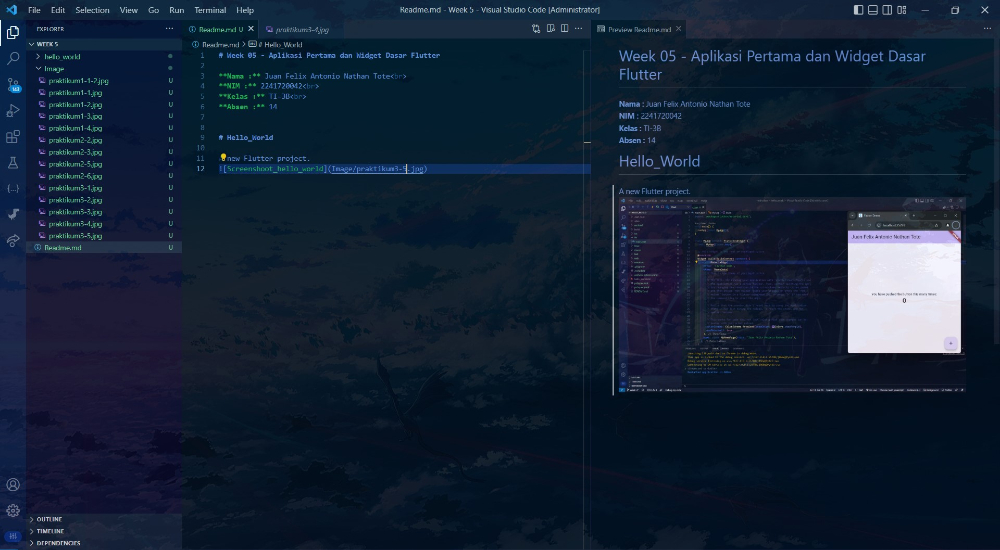

# Week 05 - Aplikasi Pertama dan Widget Dasar Flutter

**Nama :** Juan Felix Antonio Nathan Tote<br>
**NIM :** 2241720042<br>
**Kelas :** TI-3B<br>
**Absen :** 14

# Praktikum 1: 
## Membuat Project Flutter Baru
### Langkah 1:

<br>

<br>

### Langkah 2:

<br>

### Langkah 3:

<br>

### Langkah 4:

<br>

# Praktikum 2:
### Langkah 1:
Mengaktifkan proses debug USB

<br>

<br>
Menginstal Driver USB Google (khusus Windows)
<br>

<br>

<br>
Menjalankan aplikasi di perangkat Android menggunakan kabel
<br>

<br>

<br>

# Praktikum 3:
## Membuat Repository GitHub dan Laporan Praktikum
### Langkah 11

<br>

<br>

<br>

<br>

<br>

### Langkah 12:

<br>

# Praktikum 4:
## Menerapkan Widget Dasar
### Langkah 1: Text Widget

<br>

### Langkah 2: Image Widget

<br>

# Praktikum 5:
## Menerapkan Widget Material Design dan iOS Cupertino
### Langkah 1: Cupertino Button dan Loading Bar
<br>
Buat file di basic_widgets > loading_cupertino.dart

```dart
return MaterialApp(
      home: Container(
        margin: const EdgeInsets.only(top: 30),
        color: Colors.white,
        child: Column(
          children: <Widget>[
            CupertinoButton(
              child: const Text("Contoh button"),
              onPressed: () {},
            ),
            const CupertinoActivityIndicator(),
          ],
        ),
      ),
    );

```
<br>


### Langkah 2: Floating Action Button (FAB)
<br>
Buat file di basic_widgets > fab_widget.dart

```dart
return MaterialApp(
      home: Scaffold(
        floatingActionButton: FloatingActionButton(
          onPressed: () {
            // Add your onPressed code here!
          },
          child: const Icon(Icons.thumb_up),
          backgroundColor: Colors.pink,
        ),
      ),
    );
```
<br>

### Langkah 3: Scaffold Widget
<br>

<br>

### Langkah 4: Dialog Widget
<br>

<br>

### Langkah 5: Input dan Selection Widget
<br>

<br>

### Langkah 6: Date and Time Pickers
<br>

<br>

<br>

# Tugas Praktikum 2:
## Menghubungkan ke perangkat fisik
### Langkah 1: Menyambungkan kabel USB ke perangkat fisik


<br>

### Langkah 2: Mengecek apakah perangkat sudah terhubung
Masuk ke terminal dan ganti direrktori utama ke direktori code dart

<br>
Cek perangkat yang terhubung

<br>

### Langkah 3: Menginstall app flutter ke dalam perangkat fisik

<br>
Mendebug salah satu code dart yang sudah terhubung perangkat fisik

<br>

### Langkah 4: Aplikasi telah terinstall

<br>


# Tugas Praktikum 3:
##  file widget tersendiri di folder basic_widgets
<video src="Image/tugas/7.mp4" width="320" height="240" autoplay muted loop controls></video>

#  Codelabs: Your first Flutter app
1. Create a project

<br><br>
2. First Hot Reload

<br><br>
3. Adding a button

<br><br>
4. Change WordPair randomly

<br><br>
5. Make the app prettier (Extract a widget, Add a Card)

<br><br>
6. Theme and style

<br><br>
7. Change Color

<br><br>
8. TextTheme

<br><br>
9. Improve accessibility

<br><br>
10. Center the UI

<br><br>
11. Wrap with Center.

<br><br>
12. Add Like Button

<br><br>
13. Add navigation rail

<br><br>
14. Clickable widgets

<br><br>
15. Stateful widgets

<br><br>
16. Add responsive design

<br><br>
17. Add responsive design (2)

<br><br>
18. Add a new page
