# Week 06 - Aplikasi Pertama dan Widget Dasar Flutter

**Nama :** Juan Felix Antonio Nathan Tote 
**NIM :** 2241720042 
**Kelas :** TI-3B 
**Absen :** 14

## Praktikum 1: Membangun Layout di Flutter
### Langkah 1: Buat Project Baru
Buatlah sebuah project flutter baru dengan nama layout_flutter.
### Langkah 2: Buka file lib/main.dart
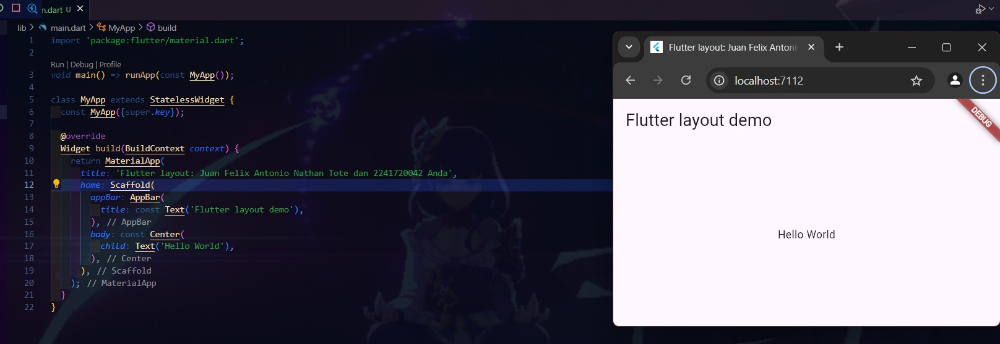
 
 

### Langkah 3: Identifikasi layout diagram
Langkah pertama adalah memecah tata letak menjadi elemen dasarnya:

- Identifikasi baris dan kolom.
 
    -  a
- Apakah tata letaknya menyertakan kisi-kisi (grid)?
 
    -  a
- Apakah ada elemen yang tumpang tindih?
 
    -  a
- Apakah UI memerlukan tab?
 
    -  a
- Perhatikan area yang memerlukan alignment, padding, atau borders.
 
    -  a

### Langkah 4: Implementasi title row

- /* soal 1 */ Letakkan widget Column di dalam widget Expanded agar menyesuaikan ruang yang tersisa di dalam widget Row. Tambahkan properti crossAxisAlignment ke CrossAxisAlignment.start sehingga posisi kolom berada di awal baris.

- /* soal 2 */ Letakkan baris pertama teks di dalam Container sehingga memungkinkan Anda untuk menambahkan padding = 8. Teks ‘Batu, Malang, Indonesia' di dalam Column, set warna menjadi abu-abu.

- /* soal 3 */ Dua item terakhir di baris judul adalah ikon bintang, set dengan warna merah, dan teks "41". Seluruh baris ada di dalam Container dan beri padding di sepanjang setiap tepinya sebesar 32 piksel. Kemudian ganti isi body text ‘Hello World' dengan variabel titleSection seperti berikut:
 

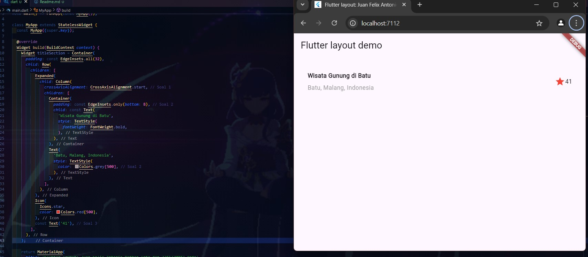
 
 

## Praktikum 2: Implementasi button row
### Langkah 1: Buat method Column _buildButtonColumn
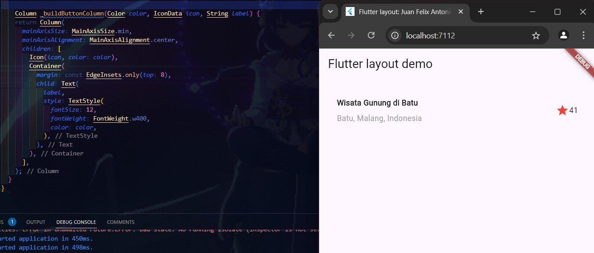
 
 

### Langkah 2: Buat widget buttonSection
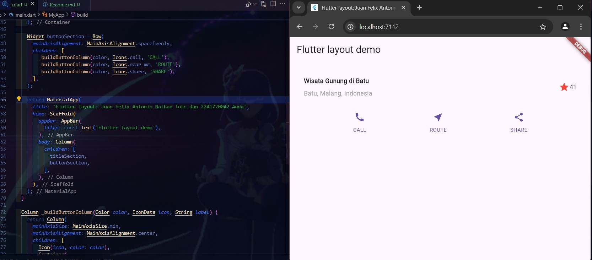

### Langkah 3: Tambah button section ke body
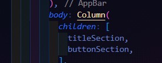
 
 

## Praktikum 3: Implementasi text section
### Langkah 1: Buat widget textSection
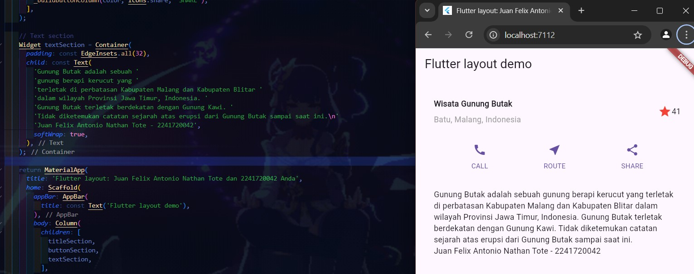
 
 

### Langkah 2: Tambah text section ke body
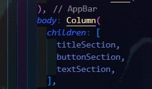
 
 

## Praktikum 4: Implementasi image section
### Langkah 1: Siapkan aset gambar
Anda dapat mencari gambar di internet yang ingin ditampilkan. Buatlah folder images di root project layout_flutter. Masukkan file gambar tersebut ke folder images, lalu set nama file tersebut ke file pubspec.yaml seperti berikut:
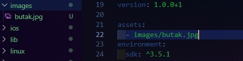
 
 

### Langkah 2: Tambahkan gambar ke body
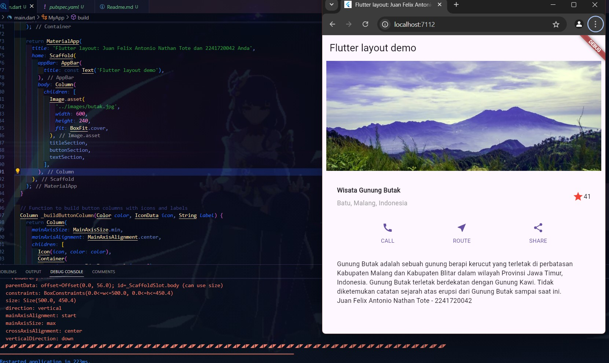
 
 

### Langkah 3: Terakhir, ubah menjadi ListView
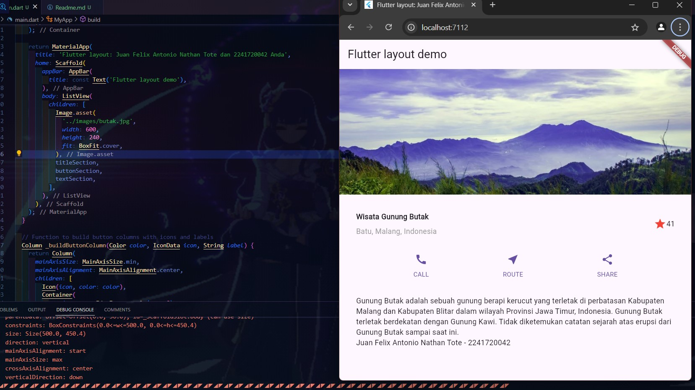

## Praktikum 5: Membangun Navigasi di Flutter
### Langkah 1: Siapkan project baru
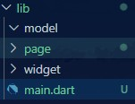
 
 

### Langkah 2: Mendefinisikan Route
