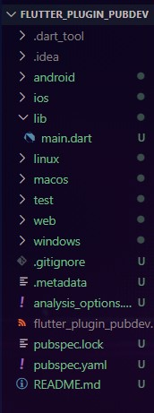
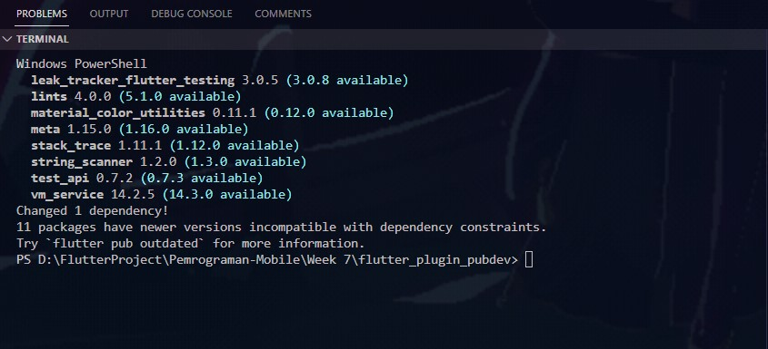
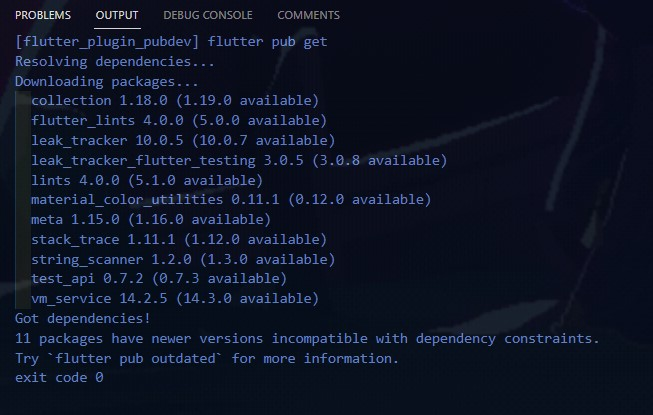
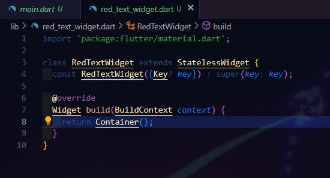
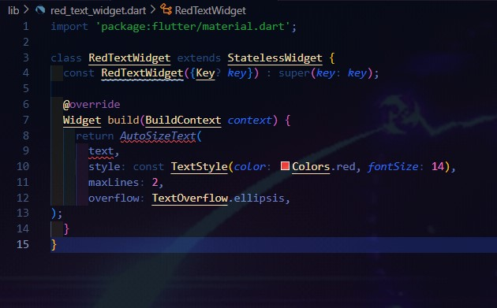
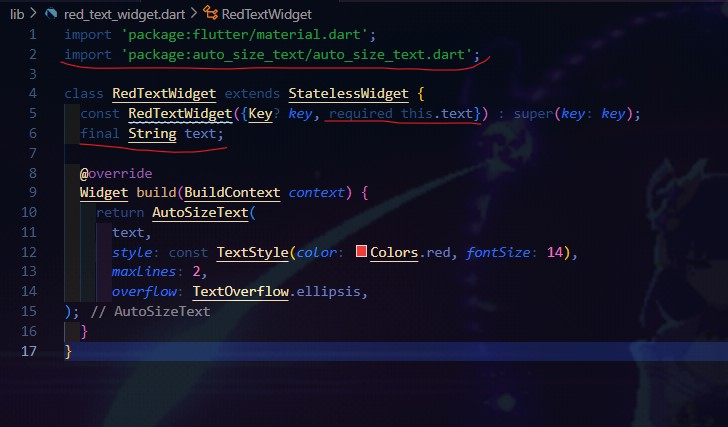
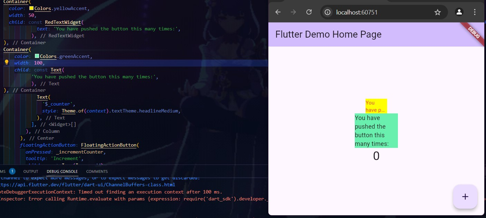

# Week 07 - Menerapkan Plugin di Project Flutter

**Nama :** Juan Felix Antonio Nathan Tote 
**NIM :** 2241720042 
**Kelas :** TI-3B 
**Absen :** 14

### Langkah 1: Buat Project Baru

 
 

### Langkah 2: Menambahkan Plugin

 
 

### Langkah 3: Buat file red_text_widget.dart

 
 

### Langkah 4: Tambah Widget AutoSizeText
Ubahlah kode return Container() menjadi seperti berikut.

Terdapat 2 error yaitu pada baris ke 8 yang terjadi dikarenakan AutoSizeText yang belum diimpor dari library yang sesuai yaitu dengan menggunakan auto_size_text. Pada baris ke 9 error terjadi dikarenakan belum menambahkan parameter text yang berfungsi untuk meneruskan teks yang akan ditampilkan ke widget RedTextWidget dan juga tambahkan konsturkor agar text bisa dioper saat widget digunakan yang dapat dilihat gambar dibawah ini

 
 

### Langkah 5: Buat Variabel text dan parameter di constructor

 
 

### Langkah 6: Tambahkan widget di main.dart
